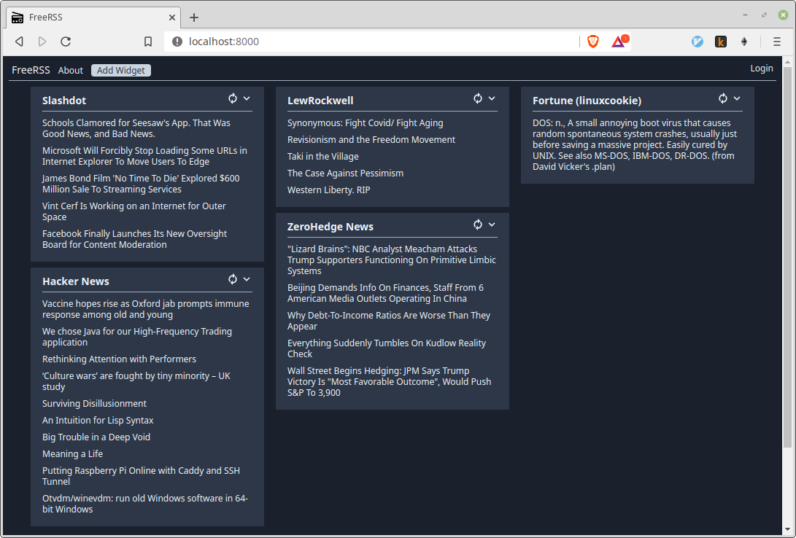
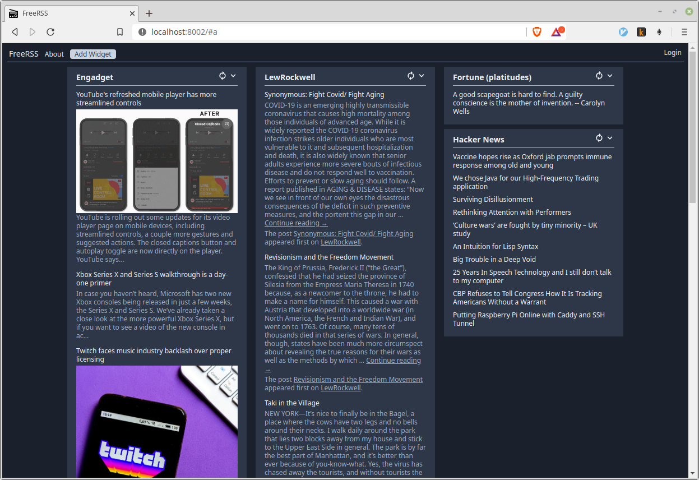

## FreeRSS

Web-based RSS Viewer and Portal.

Dependencies and Tools used:
- [gofeed library](https://github.com/mmcdole/gofeed)
- [Svelte](https://svelte.dev)
- [Tailwind CSS](https://tailwindcss.com)
- [Zondicons](http://www.zondicons.com/)

## Usage

Run once:

    $ make dep
    $ make webtools

Build and test:

    $ make clean
    $ make
    $ freerss -i portal.db

    Run 'freerss portal.db' to start the web service.

## Screenshots

## Contact
    Twitter: @robcomputing
    Source: http://github.com/robdelacruz/freerss

